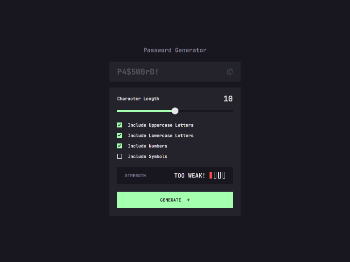
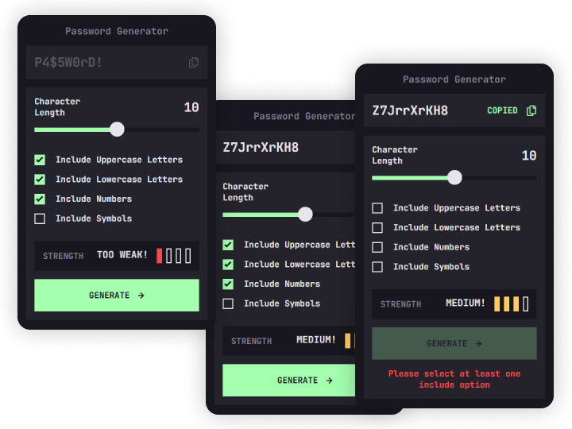
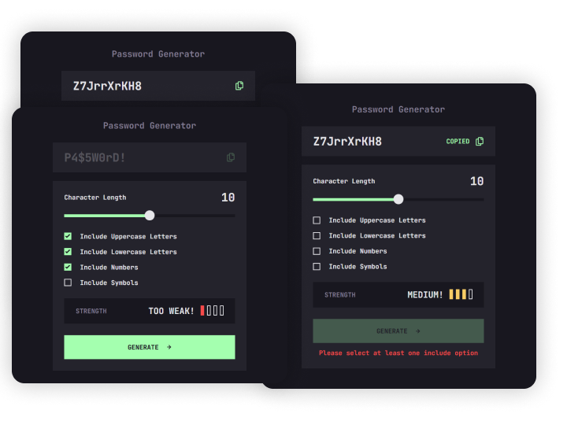

# Frontend Mentor Challenge: Password Generator App

This is a solution to the [Password Generator App challenge on Frontend Mentor](https://www.frontendmentor.io/challenges/password-generator-app-Mr8CLycqjh).

## Table of contents

- [Overview](#overview)
- [Development](#development)
  - [Stack](#stack)
  - [Tools and Workflow](#tools-and-workflow)
- [Showcase](#showcase)
  - [Screenshots](#screenshots)
- [Author](#author)

## <a name="overview">Overview 📋</a>

Users should be able to:

- Generate a password based on the selected inclusion options
- Copy the generated password to the computer's clipboard
- See a strength rating for their generated password
- View the optimal layout for the interface depending on their device's screen size
- See hover and focus states for all interactive elements on the page

## <a name="development">Development 🛠️</a>

### Stack

- **HTML5**
- **CSS3**
- **JavaScript**
- **Preact**

### Tools and Workflow

- **GitHub Pages**
- **Prettier**

## <a name="showcase">Showcase 🖼️</a>

### Screenshots

## <a name="author">Author ✍️</a>

- Website - [Ademir José Ferreira Júnior](https://github.com/Azganoth)
- Frontend Mentor - [@Azganoth](https://www.frontendmentor.io/profile/Azganoth)
